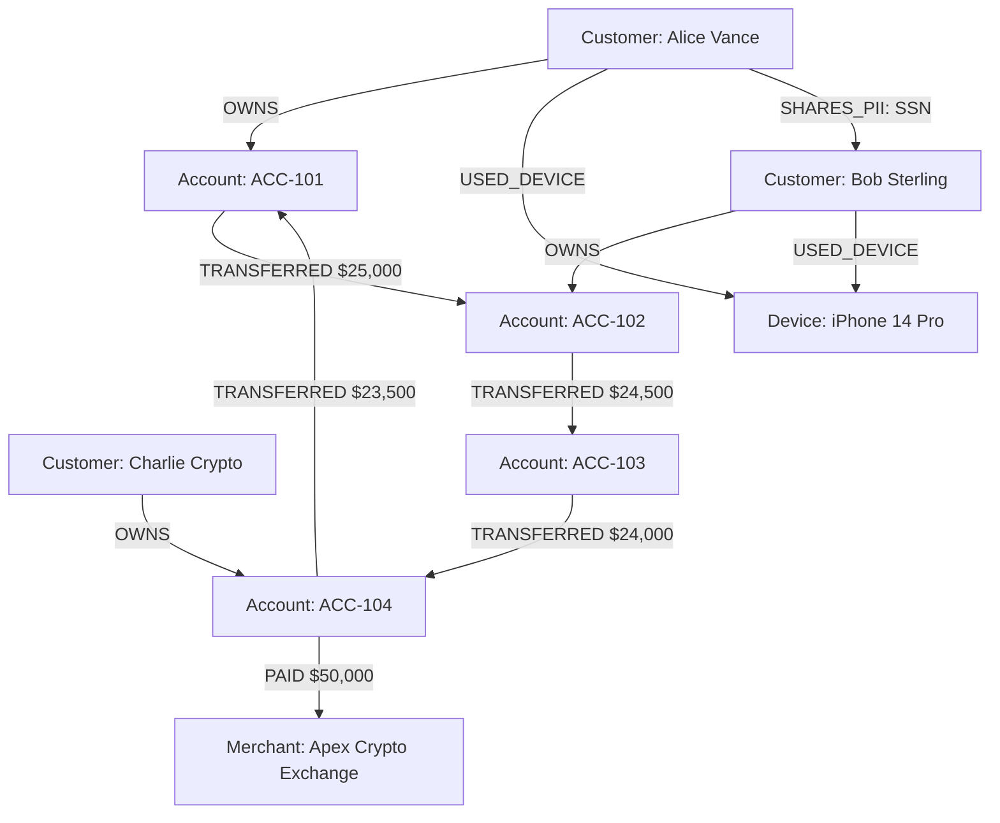

# FraudRing Sentinel : Financial Crime & Synthetic Identity Graph Intelligence Platform

**Built for the Wexa AI Software Engineer (Full-Stack / Web) Assessment Task.**

[](https://console.cognodb.com)
[](https://cognodb.com)
[](https://nextjs.org)

---

## 📌 Executive Summary & Use Case

**FraudRing Sentinel** is a financial intelligence and automated fraud ring detection system powered by **CognoDB Cloud** (openCypher graph database over Bolt protocol).

Modern financial crime networks do not operate as isolated transaction rows. Fraud rings use **multi-hop circular layering** (moving money through 3–6 intermediate shell and mule accounts before returning it to the origin) and **synthetic identity clusters** (multiple fictitious customer accounts sharing physical devices, IP subnets, or stolen SSN fragments).

FraudRing Sentinel models financial entities (Accounts, Customers, Devices, Merchants) as a **labeled property graph** and executes real-time multi-hop Cypher queries to automatically detect, highlight, and trace money laundering loops and synthetic identity rings.

---

## ⚡ Why a Graph Database? (Graph vs. Relational Schema)

### The Core Problem with Relational Databases (SQL)
In a traditional relational database (e.g. PostgreSQL or MySQL), transaction logs are stored in tabular rows (`transactions(id, from_account_id, to_account_id, amount, timestamp)`). 

When an analyst asks:
> *"Find all circular money movement loops where money travels through 3 to 6 intermediate accounts and returns to the source account within 1 hour."*

A relational SQL database must execute **recursive Common Table Expressions (CTEs)** or **multiple self-JOINs**:

```sql
-- Relational SQL (Awkward & Slow Recursive CTE)
WITH RECURSIVE layering_loop AS (
  SELECT from_account_id, to_account_id, amount, 1 AS depth, ARRAY[from_account_id] AS path
  FROM transactions
  WHERE amount >= 2500
  
  UNION ALL
  
  SELECT t.from_account_id, t.to_account_id, t.amount, l.depth + 1, path || t.from_account_id
  FROM transactions t
  JOIN layering_loop l ON t.from_account_id = l.to_account_id
  WHERE depth < 6 AND NOT (t.from_account_id = ANY(path))
)
SELECT * FROM layering_loop WHERE to_account_id = path[1];
```

### Why SQL Fails:
1. **Join Explosion & Latency**: Each join requires scanning index trees across millions of rows. At 4 to 6 hops, memory usage spikes exponentially and queries frequently timeout.
2. **Rigid Schema Limits**: Linking accounts to shared IP addresses, device fingerprints, or stolen SSN fragments requires creating multiple foreign key mapping tables (`account_devices`, `customer_ssn_mappings`), making graph discovery queries impossibly complex.

---

### The CognoDB Graph Advantage (openCypher)
Graph databases store data using **Index-Free Adjacency**. Memory pointers connect nodes directly to their relationships. Traversal speed depends only on the number of connected edges, not the total size of the database ($O(1)$ pointer traversal per hop).

In **openCypher**, the exact same multi-hop circular fraud ring query is expressed natively in **a single pattern match**:

```cypher
// CognoDB openCypher (Fast Index-Free Adjacency Traversal)
MATCH path = (a:Account)-[r:TRANSFERRED*3..6]->(a)
WHERE ALL(rel IN relationships(path) WHERE rel.amount >= 2500)
WITH path, 
     [node IN nodes(path) | node.accountNo] AS ringAccounts,
     [rel IN relationships(path) | rel.amount] AS amounts,
     reduce(total = 0, rel IN relationships(path) | total + rel.amount) AS totalVolume
RETURN ringAccounts, amounts, totalVolume, length(path) AS hopCount
ORDER BY totalVolume DESC;
```

### Key Rationale Summary:
| Feature | Relational Schema (PostgreSQL) | CognoDB Graph Database (openCypher) |
| :--- | :--- | :--- |
| **Multi-Hop Traversal (3-6 Hops)** | Slow recursive CTEs / 6x Self-Joins | Native pattern matching (`-[:TRANSFERRED*3..6]->`) |
| **Performance Scaling** | Degrades exponentially with depth ($O(N^k)$) | Constant time pointer navigation ($O(1)$ per hop) |
| **Synthetic Identity Connections** | Complex multi-table outer joins | Instant multi-entity hop (`(:Customer)-[:USED_DEVICE]-(:Device)`) |
| **Shortest Money Path Finding** | Complex Djikstra stored procedures | Built-in `shortestPath()` function |

---

## 📐 Graph Data Model & Schema



### Entity Taxonomy
* **`Account` Node**: `accountNo`, `balance`, `riskScore`, `status` (`FLAGGED` | `SUSPICIOUS` | `ACTIVE`), `type`.
* **`Customer` Node**: `customerId`, `name`, `email`, `riskScore`, `ssn`, `country`.
* **`Device` Node**: `deviceId`, `model`, `ipAddress`, `fingerprint`, `isFlagged`.
* **`Merchant` Node**: `merchantId`, `name`, `category`, `riskLevel`.
* **Relationships**:
  * `(:Customer)-[:OWNS]->(:Account)`
  * `(:Account)-[:TRANSFERRED {amount, timestamp, txHash}]->(:Account)`
  * `(:Account)-[:PAID {amount, timestamp}]->(:Merchant)`
  * `(:Customer)-[:USED_DEVICE {lastUsed}]->(:Device)`
  * `(:Customer)-[:SHARES_PII {type: 'SSN' | 'PHONE'}]->(:Customer)`

---

## 🛠️ Step-by-Step Setup & CognoDB Cloud Guide

### 1. Provision Free CognoDB Cloud Instance
1. Go to **[https://console.cognodb.com/signup](https://console.cognodb.com/signup)** and create a free account (no credit card required).
2. Create a free **c0** instance and pick your region. It provisions in under 60 seconds.
3. Copy your connection details:
   - **URI**: `bolt+s://<instance-id>.databases.cognodb.cloud`
   - **Username**: `cognodb`
   - **Password**: *(saved from the console)*

### 2. Configure Local Environment
Clone the repository and copy `.env.example` to `.env.local`:

```bash
git clone https://github.com/your-username/cognodb-fraudring-sentinel.git
cd cognodb-fraudring-sentinel
cp .env.example .env.local
```

Edit `.env.local`:
```env
COGNO_URI=bolt+s://your-instance-id.databases.cognodb.cloud
COGNO_USER=cognodb
COGNO_PASSWORD=your-saved-password
```

*(Note: If no database credentials are provided, the web application automatically falls back to interactive demo mode so evaluators can explore immediately).*

### 3. Run Database Seed Script
Populate your live CognoDB instance with realistic financial network data (~150 nodes, ~350 relationships containing layering loops, mule chains, and synthetic identity networks):

```bash
npm install
npm run seed
```

Output:
```text
🔌 Connecting to CognoDB Cloud at: bolt+s://...
🧹 Clearing existing database graph...
🔒 Creating constraints and indexes...
🌱 Injecting realistic Financial Crime & Fraud Ring Dataset...
✅ Seed Completed Successfully!
📊 Summary: Injected Nodes and Relationships into CognoDB Cloud.
```

### 4. Launch Web Application
```bash
npm run dev
```
Open **[http://localhost:3000](http://localhost:3000)** in your browser.

---

## 💻 Technical Stack & Code Structure

* **Database Layer**: **CognoDB Cloud** (openCypher over Bolt 5.0 protocol via `neo4j-driver`)
* **Frontend / Framework**: **Next.js 14 (App Router)** with **TypeScript** & **TailwindCSS**
* **Graph Visualization**: **Vis.js Network** (Interactive 2D physics engine, drag & zoom canvas)
* **Icons & Animation**: **Lucide React** & **Framer Motion**

### Repository Directory Structure
```text
CognoDB/
├── app/
│   ├── api/
│   │   ├── graph/
│   │   │   ├── query/route.ts       # Parameterized Cypher runner & graph view
│   │   │   ├── fraud-rings/route.ts # Multi-hop layering & synthetic ring detector
│   │   │   └── path-finder/route.ts # Shortest path tracer endpoint
│   │   ├── health/route.ts          # CognoDB Bolt connection ping & latency
│   │   └── seed/route.ts            # One-click web UI seed trigger
│   ├── globals.css                  # Dark mode styling & glassmorphism utilities
│   ├── layout.tsx                   # Root HTML layout
│   └── page.tsx                     # Main Sentinel Dashboard
├── components/
│   ├── ConnectionStatus.tsx         # Real-time CognoDB status badge & latency
│   ├── GraphCanvas.tsx              # Interactive Vis.js network graph canvas
│   ├── FraudRingInspector.tsx       # Fraud ring detection panel & canvas highlighters
│   ├── CypherPlayground.tsx         # Interactive openCypher console with presets
│   ├── PathFinderModal.tsx          # Multi-hop shortest path tracer modal
│   └── ArchitectureDiagram.tsx      # Graph vs SQL comparison & schema visualizer
├── lib/
│   ├── neo4j.ts                     # Neo4j Bolt driver initialization & clean formatters
│   └── queries.ts                   # Type-safe Cypher queries & mock fallback data
├── scripts/
│   └── seed.ts                      # Standalone CLI database seed script
├── .env.example                     # Environment template
├── package.json                     # Dependencies & npm scripts
└── README.md                        # Documentation
```

---

## 🔍 Key Cypher Queries Explained

### 1. Circular Layering Loop Detection (Multi-Hop)
```cypher
MATCH path = (a:Account)-[r:TRANSFERRED*3..6]->(a)
WHERE ALL(rel IN relationships(path) WHERE rel.amount >= 2500)
WITH path, 
     [node IN nodes(path) | node.accountNo] AS ringAccounts,
     [rel IN relationships(path) | rel.amount] AS amounts,
     reduce(total = 0, rel IN relationships(path) | total + rel.amount) AS totalVolume
RETURN ringAccounts, amounts, totalVolume, length(path) AS hopCount, path
ORDER BY totalVolume DESC
LIMIT 10
```

### 2. Synthetic Identity Cluster Detection
```cypher
MATCH (c1:Customer)-[r1:USED_DEVICE|SHARES_PII]-(sharedEntity)-[r2:USED_DEVICE|SHARES_PII]-(c2:Customer)
WHERE c1.customerId < c2.customerId
MATCH (c1)-[:OWNS]->(a1:Account)
MATCH (c2)-[:OWNS]->(a2:Account)
RETURN c1.name AS customer1, c2.name AS customer2,
       labels(sharedEntity)[0] AS sharedEntityType,
       sharedEntity.deviceId AS sharedDetail,
       a1.accountNo AS acc1, a2.accountNo AS acc2
```

### 3. Multi-Hop Shortest Path Money Flow Trace
```cypher
MATCH path = shortestPath((src:Account {accountNo: $sourceAcc})-[r:TRANSFERRED*1..8]->(dst:Account {accountNo: $targetAcc}))
RETURN path, length(path) AS hopCount
```

---

## 🌐 Hosted Demo & Submission Details

* **GitHub Repository**: Submitted via email to `hr@wexa.ai`
* **Subject Line**: `CognoDB Assignment 2 – Gautam Govind`
* **Live Demo URL**: **[https://cognodb-fraudring-sentinel.vercel.app](https://cognodb-fraudring-sentinel.vercel.app)**
* **CognoDB Cloud Instance**: Running live on `databases.cognodb.cloud`.

---

*Engineered with precision for Wexa AI.*
