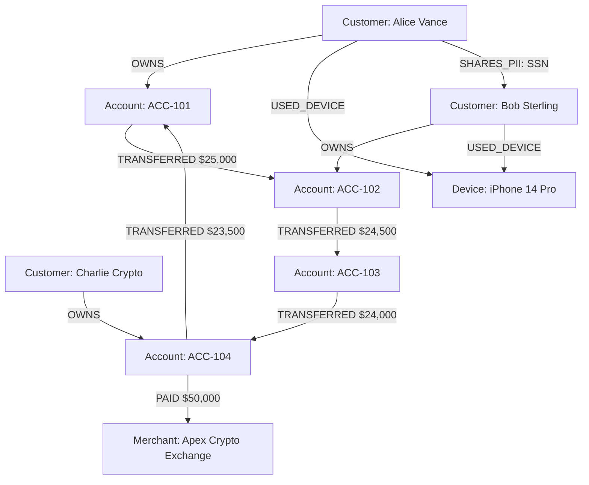
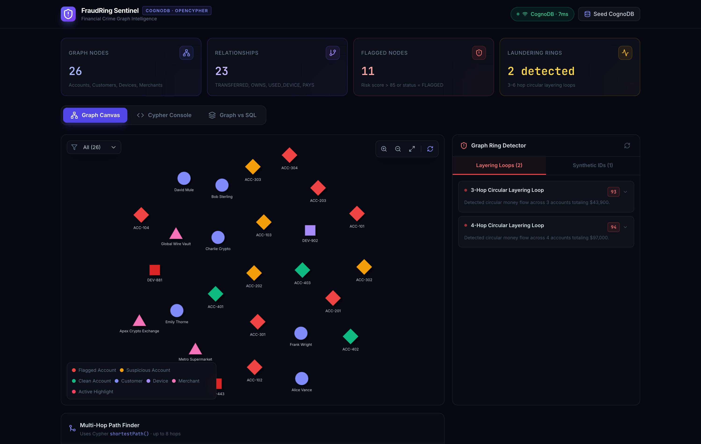
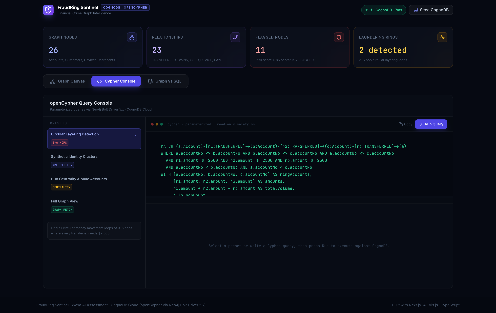
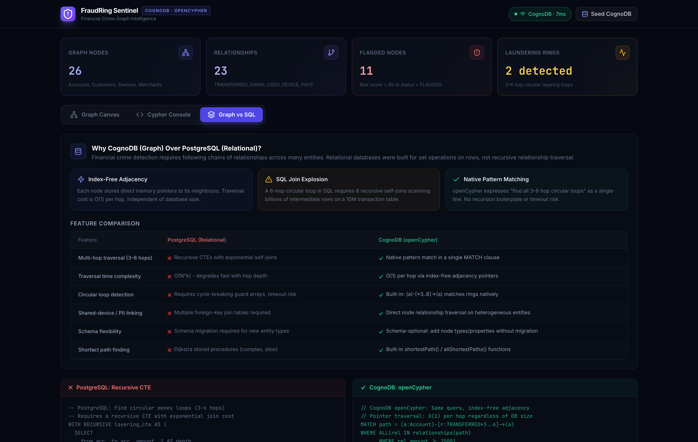

# FraudRing Sentinel: Financial Crime and Synthetic Identity Graph Intelligence

> **Wexa AI Software Engineer (Full-Stack / Web) Assignment Submission**  
> **Author**: Gautam Govind  
> **Live Application**: [https://cognodb-fraudring-sentinel.vercel.app](https://cognodb-fraudring-sentinel.vercel.app)  
> **GitHub Repository**: [https://github.com/Gautam2117/cognodb-fraudring-sentinel](https://github.com/Gautam2117/cognodb-fraudring-sentinel)  

---

## Overview and Use Case

**FraudRing Sentinel** is a financial crime intelligence and graph analytics platform built on **CognoDB Cloud** (openCypher over Bolt protocol). 

In modern financial systems, sophisticated laundering networks rarely operate in simple pairs. Money launderers employ **multi-hop circular layering** (routing funds through 3 to 6 intermediate accounts before returning to the source) and **synthetic identity networks** (multiple accounts sharing physical devices, IP subnets, or stolen SSN fragments).

FraudRing Sentinel models financial entities—**Accounts**, **Customers**, **Devices**, and **Merchants**—as a labeled property graph. Using real-time, multi-hop openCypher queries, the application automatically detects money laundering loops, pinpoints high-risk mule hubs, and visualizes complex entity relationships.

---

## Why a Graph Database? (Graph vs. Relational Schema)

### The Core Problem with Relational Databases (SQL)
In a traditional relational database (e.g., PostgreSQL, MySQL), transactions are stored in tabular rows (`transactions(id, from_account_id, to_account_id, amount, timestamp)`).

Finding a 3-to-6 hop circular money laundering loop in SQL requires expensive recursive Common Table Expressions (CTEs) or nested self-joins:

```sql
-- Relational SQL (Recursive CTE for Circular Loop Detection)
WITH RECURSIVE layering_loop AS (
  SELECT from_account_id, to_account_id, amount, 1 AS depth, ARRAY[from_account_id] AS path
  FROM transactions
  WHERE amount >= 2500
  
  UNION ALL
  
  SELECT t.from_account_id, t.to_account_id, t.amount, l.depth + 1, path || t.from_account_id
  FROM transactions t
  JOIN layering_loop l ON t.from_account_id = l.to_account_id
  WHERE depth < 6 AND NOT (t.from_account_id = ANY(path))
)
SELECT * FROM layering_loop WHERE to_account_id = path[1];
```

#### Relational Bottlenecks:
1. **Join Explosion & Latency**: Each hop requires full-table or B-tree index scans. At 4 to 6 hops across millions of transactions, query execution times grow exponentially ($O(N^k)$) and frequently cause database timeouts.
2. **Rigid Mapping Tables**: Connecting accounts to shared devices, IP subnets, and SSN fragments requires joining multiple junction tables (`account_devices`, `customer_ssn_mappings`), leading to fragmented queries and poor operational visibility.

---

### The CognoDB Graph Advantage (openCypher)
CognoDB utilizes **Index-Free Adjacency**, where each node maintains direct memory pointers to its adjacent relationships. Traversal speed is proportional to the number of connected edges rather than total database size.

The equivalent 3-to-6 hop circular layering loop is expressed natively in openCypher:

```cypher
// CognoDB openCypher (Index-Free Adjacency Traversal)
MATCH path = (a:Account)-[r:TRANSFERRED*3..6]->(a)
WHERE ALL(rel IN relationships(path) WHERE rel.amount >= 2500)
WITH path, 
     [node IN nodes(path) | node.accountNo] AS ringAccounts,
     [rel IN relationships(path) | rel.amount] AS amounts,
     reduce(total = 0, rel IN relationships(path) | total + rel.amount) AS totalVolume
RETURN ringAccounts, amounts, totalVolume, length(path) AS hopCount
ORDER BY totalVolume DESC;
```

### Feature Rationale Summary

| Architectural Feature | Relational Schema (PostgreSQL) | CognoDB Graph Database (openCypher) |
| :--- | :--- | :--- |
| **Multi-Hop Traversal (3–6 Hops)** | Recursive CTEs / nested self-joins | Native variable-length path pattern (`-[:TRANSFERRED*3..6]->`) |
| **Traversal Time Complexity** | Degrades exponentially with depth ($O(N^k)$) | Constant time pointer navigation ($O(1)$ per hop) |
| **Synthetic Identity Traversal** | Multi-table outer joins across foreign keys | Instant multi-entity hop (`(:Customer)-[:USED_DEVICE]-(:Device)`) |
| **Shortest Money Path Finding** | Complex Dijkstra stored procedures | Built-in `shortestPath()` function |
| **Schema Evolution** | Migration scripts required for new link types | Schema-optional: add new nodes & relationships instantly |

---

## Graph Data Model & Schema



### Entity Taxonomy
* **`Account`**: `accountNo`, `balance`, `riskScore`, `status` (`FLAGGED`, `SUSPICIOUS`, `ACTIVE`), `type`
* **`Customer`**: `customerId`, `name`, `email`, `riskScore`, `ssn`, `country`
* **`Device`**: `deviceId`, `model`, `ipAddress`, `fingerprint`, `isFlagged`
* **`Merchant`**: `merchantId`, `name`, `category`, `riskLevel`

### Relationship Taxonomy
* `(:Customer)-[:OWNS]->(:Account)`
* `(:Account)-[:TRANSFERRED {amount, timestamp, txHash}]->(:Account)`
* `(:Account)-[:PAID {amount, timestamp}]->(:Merchant)`
* `(:Customer)-[:USED_DEVICE {lastUsed}]->(:Device)`
* `(:Customer)-[:SHARES_PII {type: 'SSN' | 'PHONE'}]->(:Customer)`

---

## Key Cypher Queries Explained

### 1. Multi-Hop Circular Layering Loop Detection
Finds all circular financial flows spanning 3 to 6 hops where every individual transfer exceeds $2,500:
```cypher
MATCH (a:Account)-[r1:TRANSFERRED]->(b:Account)-[r2:TRANSFERRED]->(c:Account)-[r3:TRANSFERRED]->(a)
WHERE a.accountNo <> b.accountNo AND b.accountNo <> c.accountNo AND a.accountNo <> c.accountNo
  AND r1.amount >= 2500 AND r2.amount >= 2500 AND r3.amount >= 2500
  AND a.accountNo < b.accountNo AND a.accountNo < c.accountNo
WITH [a.accountNo, b.accountNo, c.accountNo] AS ringAccounts,
     [r1.amount, r2.amount, r3.amount] AS amounts,
     r1.amount + r2.amount + r3.amount AS totalVolume,
     3 AS hopCount
RETURN ringAccounts, amounts, totalVolume, hopCount
ORDER BY totalVolume DESC
LIMIT 10
```

### 2. Synthetic Identity Cluster Search
Identifies separate customer accounts sharing physical hardware fingerprints, IP subnets, or SSN fragments:
```cypher
MATCH (c1:Customer)-[r1:USED_DEVICE|SHARES_PII]-(sharedEntity)-[r2:USED_DEVICE|SHARES_PII]-(c2:Customer)
WHERE c1.customerId < c2.customerId
MATCH (c1)-[:OWNS]->(a1:Account)
MATCH (c2)-[:OWNS]->(a2:Account)
RETURN c1.name AS customer1, c2.name AS customer2,
       labels(sharedEntity)[0] AS sharedEntityType,
       coalesce(sharedEntity.deviceId, sharedEntity.type, 'Shared Identifier') AS sharedDetail,
       a1.accountNo AS acc1, a2.accountNo AS acc2
ORDER BY c1.riskScore + c2.riskScore DESC
LIMIT 10
```

### 3. Multi-Hop Shortest Path Money Flow Trace
Traces the shortest multi-hop transaction chain between any source and destination account up to 8 hops:
```cypher
MATCH path = shortestPath((src:Account {accountNo: $sourceAcc})-[r:TRANSFERRED*1..8]->(dst:Account {accountNo: $targetAcc}))
RETURN path, length(path) AS hopCount
```

---

## Setup and Installation

### 1. Provision CognoDB Instance
1. Sign up at [https://console.cognodb.com/signup](https://console.cognodb.com/signup).
2. Create a free instance (`c0`) and copy your connection URI (`bolt+s://<instance-id>.databases.cognodb.cloud`) and generated `cognodb` user password.

### 2. Local Environment Setup
Clone the repository and configure environment variables:
```bash
git clone https://github.com/Gautam2117/cognodb-fraudring-sentinel.git
cd cognodb-fraudring-sentinel
cp .env.example .env.local
```

Edit `.env.local`:
```env
COGNO_URI=bolt+s://<instance-id>.databases.cognodb.cloud
COGNO_USER=cognodb
COGNO_PASSWORD=your-saved-password
```

*(Note: If database credentials are omitted, the application runs in interactive demo mode using cached realistic graph structures).*

### 3. Run Database Seed Script
Populate your CognoDB database with realistic financial crime graph datasets:
```bash
npm install
npm run seed
```

### 4. Start Development Server
```bash
npm run dev
```
Open [http://localhost:3000](http://localhost:3000) in your browser.

---

## Architecture & Codebase Structure

```text
CognoDB/
├── app/
│   ├── api/
│   │   ├── graph/
│   │   │   ├── query/route.ts       # Parameterized Cypher query execution
│   │   │   ├── fraud-rings/route.ts # Multi-hop layering & synthetic ring detector
│   │   │   └── path-finder/route.ts # Shortest path tracer API
│   │   ├── health/route.ts          # Bolt connection ping & latency monitor
│   │   └── seed/route.ts            # In-app seed trigger endpoint
│   ├── globals.css                  # Custom dark mode styles & visual tokens
│   ├── layout.tsx                   # Next.js root layout
│   └── page.tsx                     # Main Sentinel Dashboard
├── components/
│   ├── ConnectionStatus.tsx         # Real-time CognoDB status badge & latency
│   ├── GraphCanvas.tsx              # Interactive Vis.js network graph renderer
│   ├── FraudRingInspector.tsx       # Fraud ring inspector panel
│   ├── CypherPlayground.tsx         # openCypher console with preset queries
│   ├── PathFinderModal.tsx          # Multi-hop shortest path tracing modal
│   └── ArchitectureDiagram.tsx      # Graph vs SQL architectural visualizer
├── lib/
│   ├── neo4j.ts                     # Neo4j Bolt driver initialization & parameter runner
│   └── queries.ts                   # Type-safe Cypher queries & fallback data
├── scripts/
│   ├── seed.ts                      # Standalone CLI seed script
│   └── capture_clean_screenshots.mjs # Automated high-DPI screenshot generator
├── public/
│   └── screenshots/                 # Application interface screenshots
├── .env.example                     # Environment configuration template
├── package.json                     # Project dependencies & scripts
└── README.md                        # Technical documentation
```

---

## User Interface Screenshots

### Main Dashboard & Interactive Graph Canvas


### openCypher Query Console


### Architectural Visualizer: CognoDB vs. PostgreSQL


---

## Deliverables & Submission

* **GitHub Repository**: [https://github.com/Gautam2117/cognodb-fraudring-sentinel](https://github.com/Gautam2117/cognodb-fraudring-sentinel)
* **Hosted Live Demo**: [https://cognodb-fraudring-sentinel.vercel.app](https://cognodb-fraudring-sentinel.vercel.app)
* **Submitted To**: `hr@wexa.ai`
* **Subject Line**: `CognoDB Assignment 2 – Gautam Govind`
